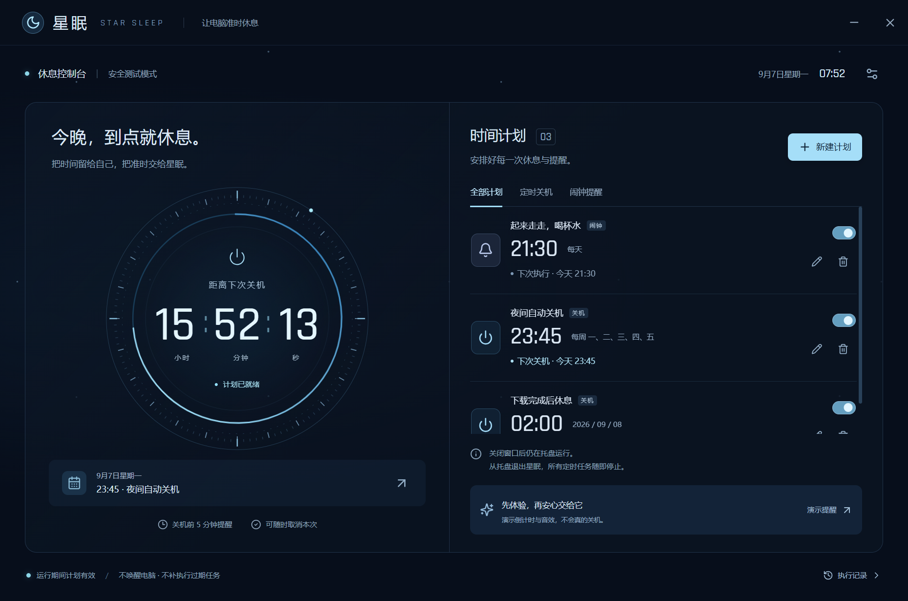
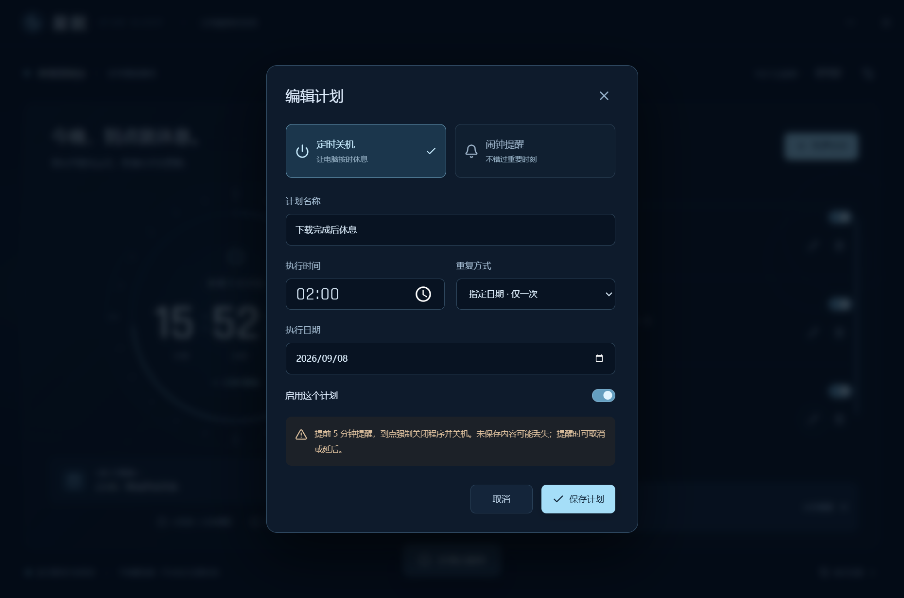
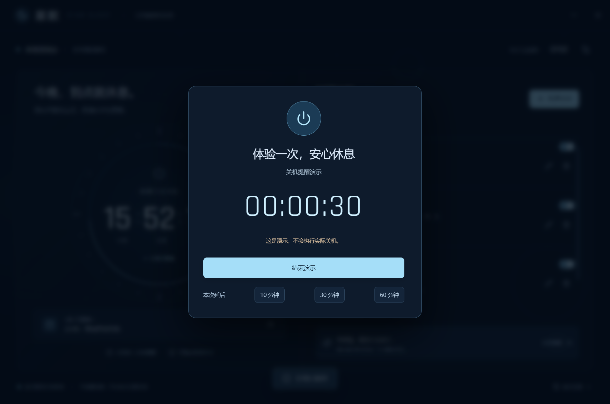

<div align="center">


# 星眠 · Star Sleep

**让 Agent 继续工作，也给电脑设一个下班时间。**

为夜间工作准备的 Windows 定时关机与闹钟工具。<br/>
冷蓝星舰控制台、环形倒计时、指尖波纹。到点提醒，按时休息。

[下载 v1.0.0](https://github.com/lcyb888/StarSleep/releases/tag/v1.0.0) · [GitHub 项目](https://github.com/lcyb888/StarSleep) · [反馈问题](https://github.com/lcyb888/StarSleep/issues) · [作者主页](https://github.com/lcyb888)

Windows 10 / 11 · x64 · 中文界面 · 离线运行

</div>



<p align="center"><sub>真实桌面截图；计划为测试示例，运行于安全测试模式。</sub></p>

## 今晚的工作，不必无限延长

睡前把编程、构建或其他本地任务交给 Agent，却担心电脑一直忙到天亮？

星眠让你提前划定一个时间：例如凌晨 02:00。电脑继续工作，关机前 5 分钟提醒；你可以取消本次，也可以再给它 10、30 或 60 分钟。到点后，由星眠请求 Windows 关机。

它适合夜间使用 AI 编程工具的人，也适合需要为下载、渲染或日常用电脑设置固定截止时间的人。

**星眠按时间执行，不判断任务是否完成。** 它不会读取 Agent 对话、统计 Token 或识别工作进度；关闭本地电脑也不保证云端任务及其计费停止。请按自己的任务预留保存时间。

## 小工具，也值得认真打磨

| 你需要的 | 星眠提供的 |
| --- | --- |
| 自己决定何时休息 | 指定日期、每天、每周任选星期；24 小时制 |
| 多个安排一起管理 | 关机与闹钟分类；新增、编辑、删除、启用和停用 |
| 临时多一点时间 | 关机前提醒，取消本次或延后；重复规则保持不变 |
| 看得清，也用得舒服 | 环形倒计时、实际下次执行时间、清晰的当前状态 |
| 有一点科幻仪式感 | 冷蓝光线、鼠标波纹、短促电子音；支持减少动态效果 |
| 安心放在本机 | 计划与记录保存在本地，离线可用，无需注册账号 |

## 三步开始

1. 从 [Releases](https://github.com/lcyb888/StarSleep/releases/tag/v1.0.0) 下载 `StarSleep-Setup-1.0.0.exe`，安装后打开桌面上的「星眠」。无需另装 Node.js。
2. 点击 **新建计划**，填写名称、动作、时间与重复方式，再保存。
3. 保持星眠运行。可以先点击 **演示提醒**，体验倒计时与声音，演示不会实际关机。

> **到点会强制关机，未保存的文件和任务进度可能丢失。** 提醒出现时可取消或延后。锁屏期间仍会执行计划，需解锁后才能操作提醒。

<details>
<summary>看看编辑与提醒界面</summary>





</details>

## 只有星眠在运行，计划才有效

| 当前状态 | 会发生什么 |
| --- | --- |
| 窗口打开或最小化 | 正常计时 |
| 点击右上角 × | 隐藏到系统托盘，继续计时 |
| 托盘菜单选择「退出星眠 · 停止所有任务」 | 停止所有计时和提醒 |
| 电脑进入睡眠 | 不唤醒电脑；恢复后跳过错过的触发点 |
| 重新打开星眠 | 恢复未来计划；不补执行错过的关机 |

不使用 Windows 任务计划程序，不注册服务，不自动开机启动，也不提前向系统提交关机倒计时。隐藏窗口时会暂停装饰动画。

取消和延后只影响当前这次执行。同一时间到期的关机合并执行；闹钟合并展示，响铃最长 60 秒，可停止或延后 10 分钟。系统静音时无法保证听到提醒。

## 设置与本地数据

- 在 **设置与关于** 中关闭按钮音效、调整提醒音量、减少动态效果，并访问作者与项目主页。
- 计划、设置与最近 200 条记录保存于 `%APPDATA%\StarSleep\schedules.json`；同目录 `.bak` 为备份。
- 主文件损坏时会尝试恢复备份并暂停计划，请核对后重新启用。读取或写入失败时停止自动执行。
- 卸载默认保留计划，便于重新安装。卸载前先从托盘退出。
- 当前安装包未使用代码签名证书，Windows 可能显示“发布者未知”。系统更新或系统策略可能影响关机完成时间。

## 作者

**第一作者：[AsterForgeDev](https://github.com/lcyb888)** · 星眠的发起者与产品设计者

> 我喜欢借助 AI，把日常遇到的问题做成实用、耐看的产品。正在探索学习工具、自动化与游戏交互，也愿意花时间打磨每一个细节。星眠源于一个简单需求：让 Agent 夜间继续工作，也让电脑按时休息。

本项目由作者提出需求、确定体验与发布方向，并借助 AI 编程工具完成实现与测试。

## 许可：可以工作使用，请勿售卖

星眠采用自定义的 **Star Sleep No-Sale License 1.0**，公开源码，允许学习、修改与免费分享。

- **允许**个人使用，也允许在公司、接单、商业项目和其他工作场景中使用星眠。
- **禁止**出售星眠、收费提供下载或解锁，以及将其修改、改名、打包后售卖获利。
- 免费分发时须保留作者署名、版权及许可说明；修改版须注明修改，不得冒充官方版本。
- 第三方依赖继续适用各自的许可。

完整条款以 [LICENSE](LICENSE) 为准。它包含销售限制，因此本项目称为“源码公开”，不宣传为无限制开源软件。

## 开发与验证

使用 Electron、React、TypeScript 与 Vite。请准备 Windows x64、Node.js 22 和 npm。

```powershell
npm ci
npm test
npm run build
npm start
```

```powershell
npm run qa       # 安全模式下的真实桌面交互测试
npm run package  # 构建 Windows x64 安装程序
```

`npm run dev` 仅提供浏览器界面预览。测试用 `--safe-mode` 替换实际关机执行器，测试数据与真实计划隔离。请勿去掉安全参数执行自动化测试。

主进程负责调度、持久化、托盘与固定关机命令；隔离的 preload 只暴露限定接口。新增的外链入口仅允许打开预设的项目和作者地址。

查看 [验证说明](VALIDATION.md)、[版本记录](CHANGELOG.md) 与 [第三方声明](THIRD_PARTY_NOTICES.txt)。自动测试不会关闭当前电脑；模拟测试与实际关机验证分别记录。

---

<div align="center">
<sub>Made with care by AsterForgeDev · 今晚，到点就休息。</sub>
</div>
