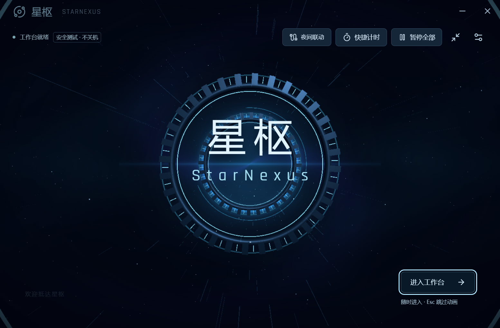
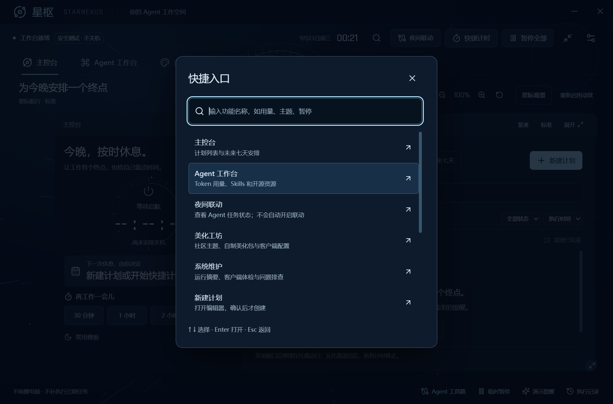
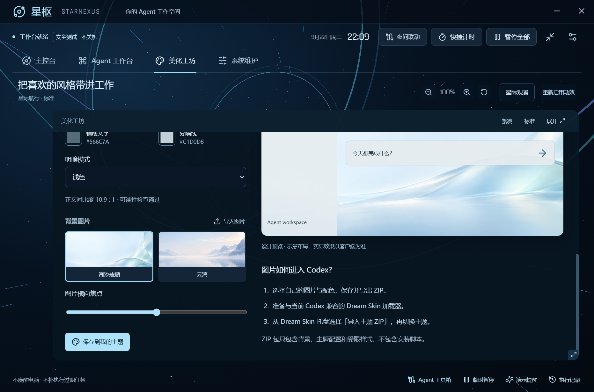
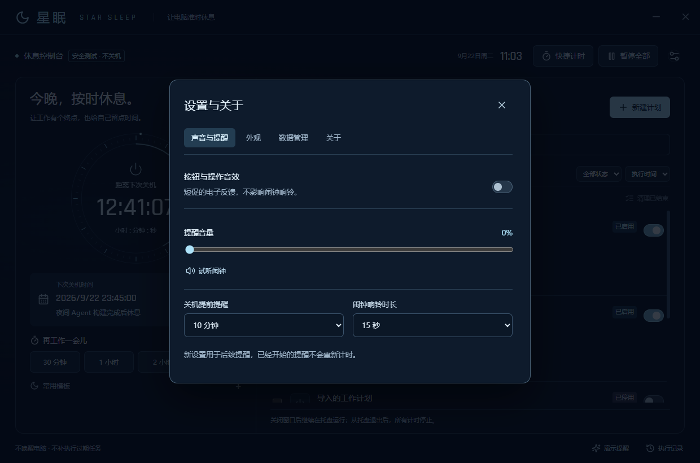
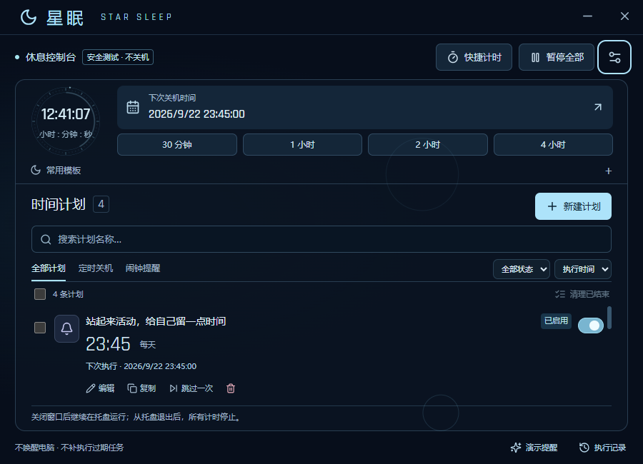
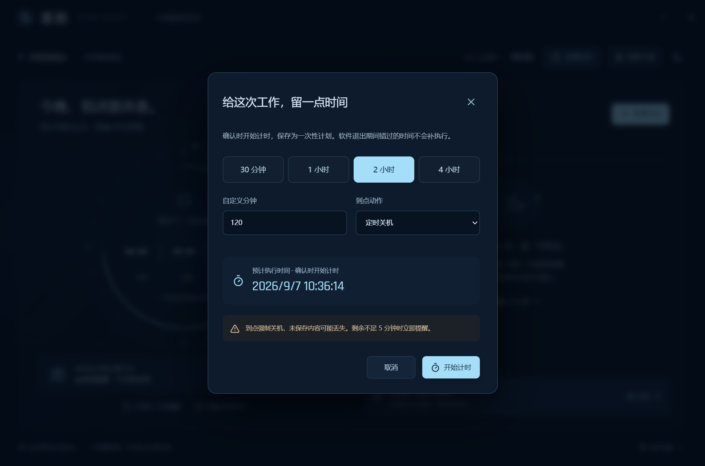
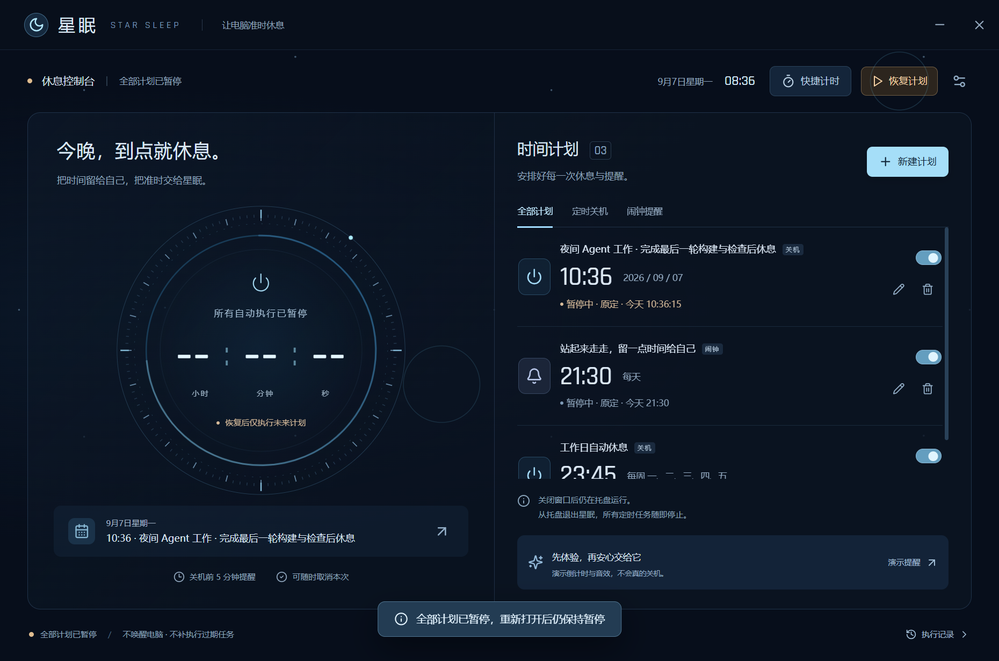
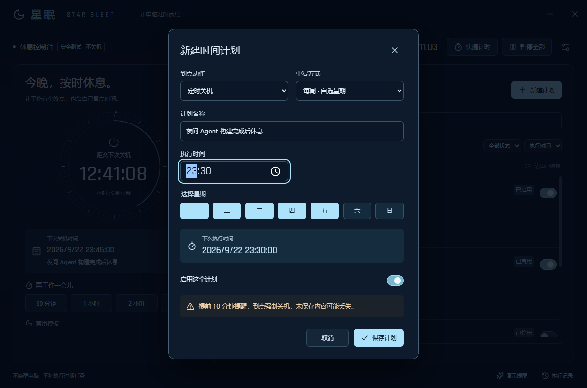
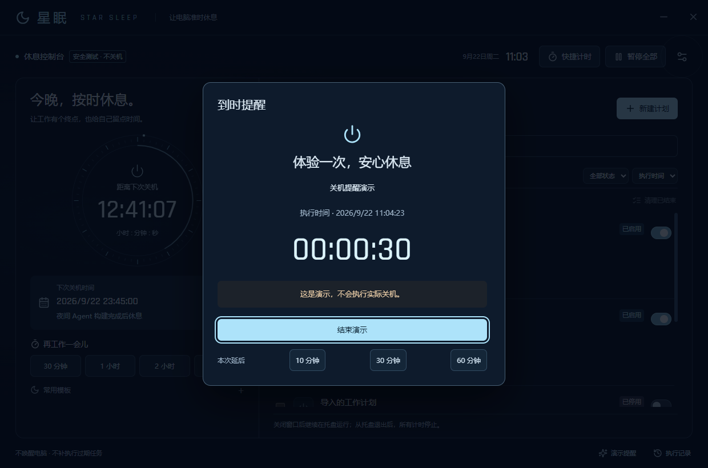

<div align="center">


# 星枢 · StarNexus

**v1.10.0：Ctrl+K 快捷入口、Token 每日明细、系统运行摘要与体检筛选。Windows 安装包与源码现已提供。**

**让灵感有处汇聚，让工作从容启程。**

为 Codex、Claude 与 DeepSeek 用户准备的 Windows Agent 工作台。<br/>
用量、Skills、社区主题与夜间联动，汇聚在同一个星际空间。

[下载安装 EXE](https://github.com/AsterVey/StarSleep/releases/download/v1.10.0/StarNexus-Setup-1.10.0.exe) · [GitHub 项目](https://github.com/AsterVey/StarSleep) · [反馈问题](https://github.com/AsterVey/StarSleep/issues) · [作者主页](https://github.com/AsterVey)

Windows 10 / 11 · x64 · 中文界面 · 定时离线运行 / GitHub 搜索需联网

</div>



<p align="center"><sub>真实桌面截图；计划为测试示例，运行于安全测试模式。</sub></p>

## 选择你的版本

当前版本为 **v1.10.0**。[点击下载 Windows x64 安装 EXE](https://github.com/AsterVey/StarSleep/releases/download/v1.10.0/StarNexus-Setup-1.10.0.exe)，下载后双击安装。完整附件见 [Release 页面](https://github.com/AsterVey/StarSleep/releases/tag/v1.10.0)。源码 ZIP 供开发使用，不是安装包。

**v1.10.0 新增**全局功能搜索、每日 Token 明细与缓存读取占比、运行摘要和体检待处理项筛选；修复手动刷新缓存与体检错误残留，保留工具页筛选和备注草稿。[更新说明](docs/RELEASE-v1.10.0.md) · [测试报告](docs/VALIDATION-v1.10.0.md)。



**v1.9.1 新增**约 6.4 秒的三阶段星门跃迁开场，随时跳过，支持观景重播。提醒优先，静态模式直接进入工作台。[更新说明](docs/RELEASE-v1.9.1.md) · [测试报告](docs/VALIDATION-v1.9.1.md)。

**v1.9.0 新增**可跳过启动动画、星际观景、重新整理的工作布局，以及三端自制配色和 Codex 图片主题 ZIP。第一作者 AsterVey；保留旧数据目录与连接协议。[新版说明](docs/RELEASE-v1.9.0.md) · [测试报告](docs/VALIDATION-v1.9.0.md)。

**v1.8.0 功能继续保留：**四个空间节点与单 Canvas 三维场景；空白区滚轮缩放，功能面板可拖动伸缩。社区工坊提供 8 个资源入口、5 个固定提交的主题下载，支持取消、重试、文件拖入、来源追踪和效果确认。只读体检检查配置与 Skills 文件；独立操作日志修复安装中断后的记录一致性。[新版使用说明](docs/RELEASE-v1.8.0.md) · [测试报告](docs/VALIDATION-v1.8.0.md) · [开源复用](docs/OPEN-SOURCE-v1.8.0.md)。



延续 **Agent 工作台 → 发现与安装**：搜索 GitHub 公开仓库，发现 Skills，查看固定提交的文件原文与静态风险线索，安装到 Codex / Claude Code / DeepSeek Harness 的目录；Claude 桌面聊天提供 ZIP 导出后上传指引。安装记录支持移除和恢复，拒绝覆盖或删除用户修改。详见 [v1.7.0 使用说明](docs/RELEASE-v1.7.0.md) 和 [开源复用记录](docs/OPEN-SOURCE-v1.7.0.md)。

点击底部 **Agent 工具箱**：按时间和模型查看 Codex / Claude Code 本地 Token 用量，搜索 10 项作者开源资源、保存收藏备注，查看本机 Skills。统计复用 **ccusage 20.0.24（MIT）** 原版 Windows 引擎；不等于账号额度或账单，DeepSeek / Claude Chat 用量尚未接入。详见 [v1.6.0 使用与验证说明](docs/RELEASE-v1.6.0.md) 和 [开源复用记录](docs/OPEN-SOURCE-v1.6.0.md)。

还想继续工作时，点击底部 **临时暂停**，选择时长或恢复时间；托盘也有快捷入口。暂停期间错过的任务会跳过，Agent 关机联动需要重新手动开启。创建计划或快捷计时时可填写 **备注**，如“先保存文件，再检查构建结果”，提醒时一起显示。详见 [v1.5.0 使用说明](docs/RELEASE-v1.5.0.md)。

美化入口：**美化工坊 → 我的主题 → 原界面美化**。支持 Codex 原生主题、Claude Theme Mod JSON、DeepSeek Dream Skin 主题包，以及 CSS / Dream Skin ZIP 收藏导出。图片导入后进入 DeepSeek 背景库。配置条件与操作步骤见 [三端美化说明](docs/CLIENT-THEMES.md)；并非任意主题都能跨客户端应用。

在「美化工坊 → 我的主题 → DeepSeek 背景」预览「潮汐琉璃」「云湾」，或导入自己的 PNG / JPEG / WebP 图片。导出后，在 DeepSeek 的「设置 → Theme / 外观 → 选择图片」导入。图片库本身不会自动改写客户端设置。详细说明见 [v1.4.2 更新与验证](docs/RELEASE-v1.4.2.md)。

**v1.4.1 接入修复**：安全体验现在提供“接入真实 Codex（不关机）”，原先的隔离写入明确命名为“模拟配置”。配置完成后，在 Codex 设置的 Hooks 页面审核并信任星眠 hooks，再发送新任务。文件写入、客户端信任和收到任务事件是三个不同阶段。详见 [接入修复与验证](docs/RELEASE-v1.4.1.md)。

**v1.4.0 起**增加了给 Codex／Claude 原界面配置主题的入口。Codex 支持原生主题字段的备份、应用与恢复；Claude 必须先有兼容加载器，本机商店版尚不支持直接应用。Agent 联动已完成星眠侧安全模拟，真实客户端全流程仍待验收。先阅读 [预览版边界](docs/RELEASE-v1.4.0.md) 与 [客户端美化说明](docs/CLIENT-THEMES.md)，不要把导入主题库理解为已经换肤。

**普通用户安装软件：双击 `StarNexus-Setup-1.10.0.exe`。** 本地文件位于 `release/v1.10.0/`，无需另装 Node.js。
`StarNexus-Source-1.10.0.zip` 是开发源码，**不是安装包的压缩版**。

本地交付目录还提供 `体验星枢.cmd`：打开隔离的安全体验窗口，数据仅写入体验目录，不影响原有计划，也不会真实关机。
需要正式使用定时关机时再安装 EXE；主动安装新版会升级现有安装。

| 版本 | 包含的功能 | 下载 |
| --- | --- | --- |
| **v1.10.0 当前版** | Agent 工作台、Skills、主题工坊、星际界面、Token 明细与快捷入口 | [安装 EXE 与源码](https://github.com/AsterVey/StarSleep/releases/tag/v1.10.0) |
| **v1.8.0 本地体验版** | 3D 星际界面、社区工坊、配置体检、安装中断恢复 | 本地 `release/v1.8.0/`，推荐先运行 `体验新版.cmd` |
| v1.7.0 本地体验版 | GitHub Skills 搜索、审查与一键安装 | 本地 `release/v1.7.0/` |
| **v1.6.0 本地体验版** | Token 用量看板、开源资源收藏、本机 Skills 清单 | 本地 `release/v1.6.0/`，先运行 `体验新版.cmd` |
| **v1.5.0 本地体验版** | 临时暂停自动恢复、计划备注与备注搜索、200% 缩放操作修正 | 本地 `release/v1.5.0/`，先运行 `体验新版.cmd` |
| v1.4.3 本地体验版 | 三端美化文件导入、配置指南及 DeepSeek 背景应用 | 本地 `release/v1.4.3/` |
| v1.4.0 开发预览 | Codex 原生主题配置、Claude 加载器检测及配置、Agent 联动安全模拟；[适配限制](docs/RELEASE-v1.4.0.md) | 本地 `release/v1.4.0/`，先运行 `体验新版.cmd` |
| **v1.3.0 本地体验版** | 同窗口迷你模式、未来七天、个人模板与星舰状态互动 | 本地 `release/v1.3.0/` |
| v1.2.0 本地体验版 | 全新布局、搜索筛选、批量管理、复制与跳过、模板、提醒设置、记录筛选导出 | 本地 `release/v1.2.0/`，等待体验反馈后发布 |
| **v1.1.0 历史优化版** | 全部基础功能，加快捷计时、全局暂停、计划导入导出与界面优化 | [安装与源码](https://github.com/AsterVey/StarSleep/releases/tag/v1.1.0) |
| v1.0.0 基础版 | 定时关机、闹钟、重复计划、提醒、托盘与本地保存 | [安装与源码](https://github.com/AsterVey/StarSleep/releases/tag/v1.0.0) |

历史版本分别保留安装包与源码。升级保留计划；降级前请阅读 [升级与降级说明](docs/UPGRADE.md)。

## v1.3.0：让安排留在桌面一角

迷你模式显示最近关机或闹钟，支持置顶和暂停；发生提醒时自动展开。完整界面新增未来七天安排，把重复、延后和跳过一起呈现。

个人模板和四个内置模板集中管理。保存模板不会创建计划，套用后需要再次确认。仪表上的信号按钮只提供短促反馈；外观设置可关闭星舰互动或减少动态效果。


[更新说明](docs/RELEASE-v1.3.0.md) · [测试报告](docs/VALIDATION-v1.3.0.md)

## v1.2.0：更从容地安排今晚

- **计划多了也好找**：名称搜索、类型与状态筛选、三种排序；50 条一页，全选覆盖当前筛选结果。
- **少做重复操作**：批量启用、停用、删除；复制默认停用；已结束的单次计划可集中清理。
- **今晚例外，明天照常**：“跳过一次”先显示准确时间，确认后只跳过本次，不改变重复规则。
- **常用安排一键填入**：工作日 23:30 关机、每天 21:00 提醒、30 分钟后提醒、2 小时后关机，确认后才创建。
- **提醒由你调整**：提前 1／5／10／15／30 分钟提醒，闹钟响铃 15／30／60 秒。已开始的提醒不重新计时。
- **记录更清楚**：按关键词、日期或错误筛选并导出文本；导入时查看重复和过期条目的具体原因。
- **更少的闲置工作**：时钟和计划状态分开同步，音量松开后保存；隐藏窗口后停止装饰绘制，响铃按固定截止时间结束。

宽窗口左右分栏，窄窗口上下布局。支持 Ctrl+N 新建、Ctrl+F 搜索和 Esc 关闭普通面板；编辑未保存时询问是否放弃。

[本版说明](docs/RELEASE-v1.2.0.md) · [本版验收](docs/VALIDATION-v1.2.0.md)

<details>
<summary>新版设置与小窗口</summary>




</details>

## 今晚的工作，不必无限延长

睡前把编程、构建或其他本地任务交给 Agent，却担心电脑一直忙到天亮？

星眠让你提前划定一个时间：例如凌晨 02:00。电脑继续工作，默认关机前 5 分钟提醒；你可以取消本次，也可以再给它 10、30 或 60 分钟。到点后，由星眠请求 Windows 关机。

它适合夜间使用 AI 编程工具的人，也适合需要为下载、渲染或日常用电脑设置固定截止时间的人。

**星眠按时间执行，不判断任务是否完成。** 它不会读取 Agent 对话、统计 Token 或识别工作进度；关闭本地电脑也不保证云端任务及其计费停止。请按自己的任务预留保存时间。

## 小工具，也值得认真打磨

| 你需要的 | 星眠提供的 |
| --- | --- |
| 自己决定何时休息 | 指定日期、每天、每周任选星期；24 小时制 |
| 多个安排一起管理 | 关机与闹钟分类；新增、编辑、删除、启用和停用 |
| 临时多一点时间 | 关机前提醒，取消本次或延后；重复规则保持不变 |
| 看得清，也用得舒服 | 环形倒计时、实际下次执行时间、清晰的当前状态 |
| 有一点科幻仪式感 | 冷蓝光线、鼠标波纹、短促电子音；支持减少动态效果 |
| 安心放在本机 | 计划与记录保存在本地，离线可用，无需注册账号 |

## v1.1.0：把常用操作放到手边

**这次再工作一会儿。** 点工具栏「快捷计时」，选择 30 分钟、1／2／4 小时，或自定义 1–1440 分钟。选择关机或闹钟，核对预计时间后开始。它会保存准确的截止时刻，重启不会重新倒计时。

**今晚临时改了主意。** 点「暂停全部」，或从托盘、实际提醒面板暂停。所有自动执行和当前响铃停止，单条计划的启用状态保留；重新打开仍暂停。主动恢复后，错过的触发点会跳过。

**换电脑，也带上计划。** 在设置中导出 JSON，再选择文件导入。先看可导入、重复与过期项的数量；确认后追加，导入项全部停用。文件上限 1 MB、最多 500 条计划，不携带本机路径、执行记录或临时延后。

<details>
<summary>看看 v1.1.0 的快捷计时与导入预览</summary>






</details>

## 三步开始

1. 本地体验版双击 `StarSleep-Setup-1.2.0.exe` 安装，再打开桌面上的「星眠」。公开稳定版仍可从 [Releases](https://github.com/AsterVey/StarSleep/releases/tag/v1.1.0) 下载。无需另装 Node.js。
2. 点击 **新建计划**，填写名称、动作、时间与重复方式，再保存。
3. 保持星眠运行。可以先点击 **演示提醒**，体验倒计时与声音，演示不会实际关机。

> **到点会强制关机，未保存的文件和任务进度可能丢失。** 提醒出现时可取消或延后。锁屏期间仍会执行计划，需解锁后才能操作提醒。

<details>
<summary>看看编辑与提醒界面</summary>





</details>

## 只有星眠在运行，计划才有效

| 当前状态 | 会发生什么 |
| --- | --- |
| 窗口打开或最小化，且未全局暂停 | 正常计时 |
| 暂停全部计划 | 停止自动触发，重启后仍保持暂停 |
| 点击右上角 × | 隐藏到系统托盘，继续计时 |
| 托盘菜单选择「退出星眠 · 停止所有任务」 | 停止所有计时和提醒 |
| 电脑进入睡眠 | 不唤醒电脑；恢复后跳过错过的触发点 |
| 重新打开星眠 | 恢复未来计划；不补执行错过的关机 |

不使用 Windows 任务计划程序，不注册服务，不自动开机启动，也不提前向系统提交关机倒计时。隐藏窗口时会暂停装饰动画。

取消和延后只影响当前这次执行。同一时间到期的关机合并执行；闹钟合并展示，响铃最长 60 秒，可停止或延后 10 分钟。系统静音时无法保证听到提醒。

## 设置与本地数据

- 在 **设置** 的四个分区中调整声音、提醒时间与外观，管理导入导出，并访问作者与项目主页。
- 计划、设置与最近 200 条记录保存于 `%APPDATA%\StarSleep\schedules.json`；同目录 `.bak` 为备份。
- 主文件损坏时会尝试恢复备份并暂停计划，请核对后重新启用。读取或写入失败时停止自动执行。
- 个人模板、窗口位置和体验偏好独立保存于 `experience.json`，附 `.bak` 备份；体验文件故障只停用相关保存功能，不停止有效计划。
- 卸载默认保留计划，便于重新安装。卸载前先从托盘退出。
- 当前安装包未使用代码签名证书，Windows 可能显示“发布者未知”。系统更新或系统策略可能影响关机完成时间。

## 作者

**第一作者：[AsterVey](https://github.com/AsterVey)** · 星眠的发起者与产品设计者

> 专注工具、自动化与交互设计，重视实用功能与每一个操作细节。星枢汇聚 Agent 工作、社区资源与个性化配置。

第一作者：AsterVey。

## 许可：仅限非商业使用

当前版本采用 **StarNexus Noncommercial License 2.0**，第一作者 **AsterVey**。

- 允许个人非商业使用、学习、非商业研究、修改和免费分享。
- 未经作者书面授权，禁止用于商业项目、企业经营或接单等有偿工作；禁止销售、付费分发、订阅、收费托管及相关收费服务。
- 分发时须保留署名、版权与许可；改版须注明修改，不能冒充官方版本。
- 第三方组件与主题适用各自许可证。历史 Release 继续以其随附许可为准。

完整条款见 [LICENSE](LICENSE)。这是限制商业使用的源码公开项目，不属于允许任意用途的开源许可。商业授权可通过 [作者主页](https://github.com/AsterVey)联系。

## 开发与验证

使用 Electron、React、TypeScript 与 Vite。请准备 Windows x64、Node.js 22 和 npm。

```powershell
npm ci
npm test
npm run build
npm start
```

```powershell
npm run qa       # v1.3 迷你、模板、预览与缩放验证
npm run qa:regression # 原有桌面交互与隐藏音频回归
npm run package  # 构建 Windows x64 安装程序
npm run qa:performance # 与本地 v1.2.0 打包程序对比
npm run qa:upgrade     # 本地两版打包程序的数据兼容验证
```

`npm run dev` 仅提供浏览器界面预览。测试用 `--safe-mode` 替换实际关机执行器，测试数据与真实计划隔离。请勿去掉安全参数执行自动化测试。

性能与升级脚本需要本机已有 `release/v1.2.0/win-unpacked/` 的历史打包程序；升级脚本同时需要本版 `release/v1.3.0/win-unpacked/`。源码 ZIP 不包含这些可执行程序。

本地存储版本 2 支持暂停状态和快捷计划，导入导出使用独立的计划文件格式。

主进程负责调度、持久化、托盘与固定关机命令；隔离的 preload 只暴露限定接口。新增的外链入口仅允许打开预设的项目和作者地址。

查看 [验证说明](VALIDATION.md)、[版本记录](CHANGELOG.md) 与 [第三方声明](THIRD_PARTY_NOTICES.txt)。自动测试不会关闭当前电脑；模拟测试与实际关机验证分别记录。

---

<div align="center">
<sub>Made with care by AsterVey · 今晚，到点就休息。</sub>
</div>
